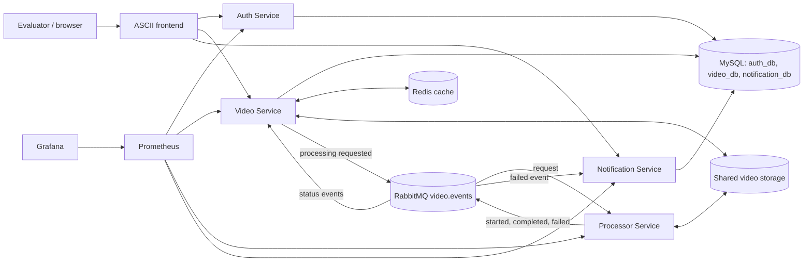

# FIAP X architecture and flow

FIAP X separates authenticated HTTP responsibilities from asynchronous video processing. It runs
locally on Minikube and can be deployed to a prepared Kubernetes production environment.

## Component view

## Responsibilities and boundaries

| Component              | Responsibility                                                                                                                                                                                                              | Explicit boundary                                                                                                        |
| ---------------------- | --------------------------------------------------------------------------------------------------------------------------------------------------------------------------------------------------------------------------- | ------------------------------------------------------------------------------------------------------------------------ |
| Frontend               | Login, upload form, video/status list, internal notifications, download/retry actions, and visible-page polling every 3 seconds.                                                                                            | Does not authorize access, process video, send a user-selected `userId`, or provide real-time WebSocket/SSE updates.     |
| Auth Service           | Validate username/password against `auth_db` and issue one-hour HS256 JWT Bearer tokens by default.                                                                                                                         | No registration, refresh token, password recovery, MFA, RBAC, or server-side logout.                                     |
| Video Service          | Authenticate JWTs; enforce ownership; accept uploads; persist catalog state in `video_db`; use Redis as a disposable cache; publish processing requests; consume status events; stream completed ZIPs; accept manual retry. | Does not run FFmpeg and does not place video bytes in RabbitMQ, MySQL, or Redis. Redis failure falls back to MySQL.      |
| Processor Service      | Consume one processing request at a time per instance, extract frames with FFmpeg, create `output.zip`, clean temporary files, and publish started/completed/failed events.                                                 | Internal worker with no database, public business API, or Swagger UI. Functional failures are not retried automatically. |
| Notification Service   | Consume failed-processing events idempotently, persist internal notifications in `notification_db`, and list only the authenticated user's records.                                                                         | No e-mail, SMS, push, WebSocket, SSE, read-state mutation, or external user lookup.                                      |
| RabbitMQ               | Durable topic exchange, durable quorum queues, persistent messages, publisher confirms, manual acknowledgements, redelivery, and dead-letter routing.                                                                       | Carries versioned event metadata and storage keys, never video or ZIP bytes.                                             |
| MySQL                  | Persist users, video metadata/status, and internal notifications in three logical databases.                                                                                                                                | Services do not create cross-database relationships. Processor owns no database.                                         |
| Redis                  | Cache video details and user lists for 30 seconds.                                                                                                                                                                          | Not used for JWT sessions, locks, durable state, or file content.                                                        |
| Shared storage         | Hold the uploaded input, temporary frames, and completed ZIP under owner/video UUID paths shared by Video and Processor.                                                                                                    | Input is removed only after successful ZIP creation; temporary frames are removed after every attempt.                   |
| Prometheus and Grafana | Scrape the four services' `/metrics` endpoints and show the provisioned FIAP X dashboard.                                                                                                                                   | No alert rules, Alertmanager, external telemetry platform, or production monitoring claim.                               |

## End-to-end flow

1. The evaluator signs in through the frontend. Auth reads the seeded user from `auth_db`, verifies
   the bcrypt hash, and returns a JWT whose `sub` is the user's UUID.
2. The frontend sends the token as `Authorization: Bearer <token>`. Video and Notification verify
   signature, HS256 algorithm, issuer, audience, expiry, and required claims. Data access is always
   scoped to `sub`.
3. The user selects one MP4, AVI, MOV, MKV, WMV, FLV, or WebM file, at most 200 MiB. `fps` is the
   number of images extracted per second: an integer from 1 to 10, default 1. The browser validates
   these rules, and Video enforces them again, including file-signature validation.
4. Video saves the input in shared storage, creates a `QUEUED` record with attempt 1, and publishes
   `video.processing.requested`. It returns HTTP 202 only after RabbitMQ publisher confirmation.
5. Processor consumes the request with manual acknowledgement and prefetch 1. It publishes
   `video.processing.started`, runs FFmpeg using `fps=<value>`, writes deterministic PNG frames,
   creates `output.zip`, and cleans the temporary frame directory.
6. On success, Processor removes the input only after the ZIP exists, publishes
   `video.processing.completed`, and RabbitMQ delivers the status to Video. Video changes the
   matching owner/video/attempt from `PROCESSING` to `COMPLETED` and invalidates its Redis caches.
7. On a known FFmpeg or ZIP failure, Processor preserves the input, cleans temporary files, and
   publishes `video.processing.failed` with `FFMPEG_ERROR` or `ZIP_ERROR`. Video records `FAILED`;
   Notification stores one internal notification per video attempt.
8. While authenticated and the page is visible, the frontend polls the video and notification APIs
   every 3 seconds without overlapping requests.
9. For `COMPLETED`, the owner can stream the ZIP through `GET /videos/:id/download`. For `FAILED`,
   the owner can request `POST /videos/:id/retry`; Video verifies the retained input, atomically
   increments the attempt, returns the record to `QUEUED`, and publishes a new confirmed request.

## HTTP failure semantics

There are two different failure stages:

- Before a job is accepted, invalid file, size, fps, multipart, UUID, or query input returns HTTP 400. Storage, MySQL, RabbitMQ publication, or unexpected request-time failures return a sanitized
  HTTP 500. Authentication, ownership, and state conflicts use the documented 401, 404, and 409
  responses.
- After asynchronous processing starts, a known FFmpeg/ZIP failure is domain state, not a failed
  status request. `GET /videos/:id` returns HTTP 200 with `success: false`, status `FAILED`, and the
  functional error code/message.

Detailed endpoint schemas are available in the [Auth](authentication.md),
[Video](video-service.md), and [Notification](notification-service.md) service documents and their
Swagger UIs. Messaging bindings and acknowledgement rules are in
[RabbitMQ topology](rabbitmq-topology.md).
